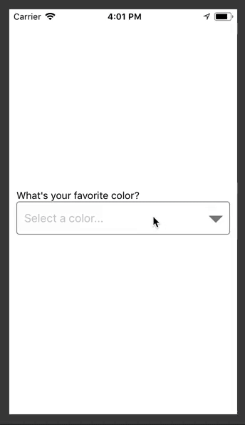
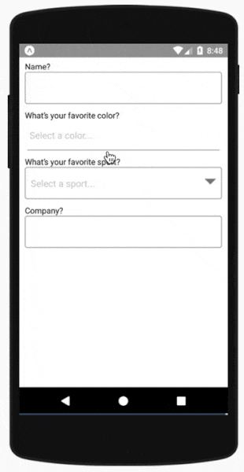

# react-native-picker-select

A Picker component for React Native which emulates the native `<select>` interfaces for iOS and Android

For iOS, we are wrapping a TextInput component. You can pass down your custom styling to match your other inputs.

For Android, we are using the native Picker component, but adding a pseudo-underline to emulate a typical TextInput. Additional styling can be passed down also to further customize the appearance.

For either platform, you can alternatively pass down a child element that will be wrapped in a touchable area, triggering the picker.

 

[Examples](https://github.com/lawnstarter/react-native-picker-select/tree/master/example)

[Run example](https://snack.expo.io/@lfkwtz/react-native-picker-select)

## Getting Started

### Installing

`npm install react-native-picker-select`

### Versioning

| Component | React   |
| --------- | ------- |
| >= 3.0.0  | >= 16.3 |
| < 3.0.0   | < 16.3  |

### Props

| Name                        | Type           | Description                                                                                                                                                                                                                                                                                                                              | Required? | iOS / Android |
| --------------------------- | -------------- | ---------------------------------------------------------------------------------------------------------------------------------------------------------------------------------------------------------------------------------------------------------------------------------------------------------------------------------------- | --------- | ------------- |
| onValueChange               | function       | Callback which returns `value, index`                                                                                                                                                                                                                                                                                                    | Y         | Both          |
| items                       | array          | The items for the component to render  - Each item should be in the following format: `{label: 'Orange', value: 'orange', key: 'orange', color: 'orange'}` - The label and the value are required - The key and color are optional - The key will be set to the label if not included - The value can be any data type | Y         | Both          |
| placeholder                 | object         | - An override for the default placeholder object with a label of `Select an item...` and a value of `null` - An empty object can be used if you'd like to disable the placeholder entirely                                                                                                                                            | N         | Both          |
| disabled                    | boolean        | Disables interaction with the component                                                                                                                                                                                                                                                                                                  | N         | Both          |
| value                       | any            | Will attempt to locate a matching item from the `items` array by checking each item's `value` property. If found, it will update the component to show that item as selected. If the value is not found, it will default to the first item.                                                                                              | N         | Both          |
| itemKey                     | string, number | Will attempt to locate a matching item from the `items` array by checking each item's `key` property. If found, it will update the component to show that item as selected. If the key is not found, it will attempt to find a matching item by `value` as above.                                                                        | N         | Both          |
| style                       | object         | Style overrides for most parts of the component. More details below.                                                                                                                                                                                                                                                                     | N         | Both          |
| hideIcon                    | boolean        | Hides the floating downward arrow on the right side of the input box                                                                                                                                                                                                                                                                     | N         | Both          |
| pickerProps                 | object         | Additional props to pass to the Picker (some props are used in core functionality so use this carefully)                                                                                                                                                                                                                                 | N         | Both          |
| placeholderTextColor        | color          | Overrides the default placeholder color shown                                                                                                                                                                                                                                                                                            | N         | iOS           |
| useNativeAndroidPickerStyle | boolean        | DEFAULTS TO TRUE. The component defaults to using the native React Native Picker in it's un-selected state. Setting this flag to false will mimic the default iOS presentation where a tappable TextInput is displayed. See more in the styling section.                                                                                 | N         | Android       |
| hideDoneBar                 | boolean        | Hides the bar with tabbing arrows and Done link to exit the modal. While this is typical on `select` elements on the web, the [interface guidelines](https://developer.apple.com/ios/human-interface-guidelines/controls/pickers/) does not include it.                                                                                  | N         | iOS           |
| onUpArrow / onDownArrow     | function       | Presence enables the corresponding arrow - Closes the picker - Calls the callback provided                                                                                                                                                                                                                                         | N         | iOS           |
| onDonePress                 | function       | Callback when the 'Done' button is pressed                                                                                                                                                                                                                                                                                               | N         | iOS           |
| modalProps                  | object         | Additional props to pass to the Modal (some props are used in core functionality so use this carefully)                                                                                                                                                                                                                                  | N         | iOS           |
| textInputProps              | object         | Additional props to pass to the TextInput (some props are used in core functionality so use this carefully)                                                                                                                                                                                                                              | N         | iOS           |

### Styling

-   iOS
    -   The component wraps a TextInput without styling. In the style prop, pass a style object named `inputIOS` to style the input
    -   Alternatively, you can pass children (such as a custom button or input) for the component to wrap
    -   Other styles that can be modified for iOS are named `inputIOSContainer`, `viewContainer`, `icon`, `chevron`, `chevronUp`, `chevronDown`, `chevronActive`, `done`, `modalViewTop`, `modalViewMiddle`, and `modalViewBottom`
-   Android
    -   The default Picker component acts similiarly to a TextInput until it is tapped, although it does not include an underline
    -   We emulate a typical underline, which can be modified with a style object named `underline`
    -   The main input can be modified with the style object named `inputAndroid`
    -   Alternatively, you can pass children (such as a custom button or input) for the component to wrap
    -   Other styles that can be modified for Android are named `headlessAndroidContainer` and `viewContainer`
    -   If you set the prop `useNativeAndroidPickerStyle` to false, the component will allow two other style objects: `inputAndroidContainer` and `inputAndroid`

## Testing

This component has been tested on React Native v0.51 - v0.57

## License

react-native-picker-select is [MIT licensed](https://github.com/lawnstarter/react-native-picker-select/tree/master/LICENSE) and built with :heart: in Austin, TX by the team at [LawnStarter](https://lawnstarter.com)
