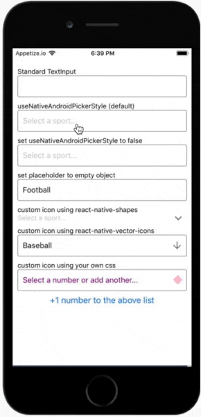
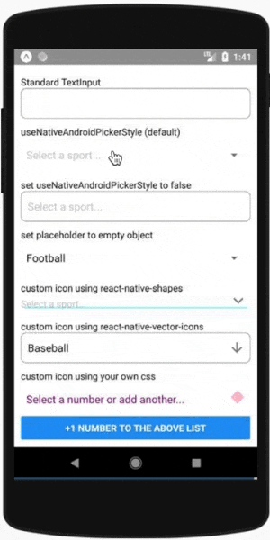

# react-native-picker-select

[](https://badge.fury.io/js/react-native-picker-select)
[](https://www.npmjs.com/package/react-native-picker-select)
[](https://codeclimate.com/github/lawnstarter/react-native-picker-select/test_coverage)
[](https://github.com/lawnstarter/react-native-picker-select/actions/workflows/build.yml)

A Picker component for React Native which emulates the native `<select>` interfaces for iOS and Android

For iOS, by default we are wrapping an unstyled TextInput component. You can then pass down styles to customize it to your needs.

For Android, by default we are using the native Picker component. If you prefer, you can set `useNativeAndroidPickerStyle` to false, which will also render an unstyled TextInput component. You can then pass down styles to customize it to your needs.

For either platform, you can alternatively pass down a child element of your choice that will be wrapped in a touchable area.

 

## [View examples on snack.expo.io](https://snack.expo.io/@lfkwtz/react-native-picker-select)

## Getting Started

### Installing

This package is built around and depends on [@react-native-picker/picker](https://github.com/react-native-picker/picker). Please make sure you install it correctly (as seen below in installation steps).

```sh
npm install react-native-picker-select

# React Native users
npm install @react-native-picker/picker
npx pod-install

# Expo
expo install @react-native-picker/picker
```

### Basic Usage

```js
import RNPickerSelect from 'react-native-picker-select';

export const Dropdown = () => {
  return (
    <RNPickerSelect
      onValueChange={(value) => console.log(value)}
      items={[
        { label: 'Football', value: 'football' },
        { label: 'Baseball', value: 'baseball' },
        { label: 'Hockey', value: 'hockey' },
      ]}
    />
  );
};
```

### Versioning

| Version       | Notes                                                                                                                                                |
| ------------- | ---------------------------------------------------------------------------------------------------------------------------------------------------- |
| >=&nbsp;8.0.0 | Uses [@react-native-picker/picker](https://github.com/react-native-picker/picker#readme). React Native 0.60 or above. If using Expo, SDK38 or above. |
| >=&nbsp;3.0.0 | React v16.3 or above.                                                                                                                                |
| <&nbsp;3.0.0  | React v16.2 or below.                                                                                                                                |

### Props

| Name                                            | Description                                                                                                                                                                                                                                                                                                                                                                                                                                                                                             | Details                  |
| ----------------------------------------------- | ------------------------------------------------------------------------------------------------------------------------------------------------------------------------------------------------------------------------------------------------------------------------------------------------------------------------------------------------------------------------------------------------------------------------------------------------------------------------------------------------------- | ------------------------ |
| `onValueChange`                                 | Callback which returns `value, index`                                                                                                                                                                                                                                                                                                                                                                                                                                                                   | **required**<br>function |
| `items`                                         | The items for the component to render<br> - Each item should be in the following format:<br>`{label: 'Orange', value: 'orange', key: 'orange', color: 'orange', inputLabel: 'Orange!', testID: 'e2e-orange'}`<br>- `label` and `value` are required<br>- `key`, `color`, `testID`, and `inputLabel` are optional<br>- `key` will be set to equal `label` if not included<br>- `value` can be any data type<br>- If `inputLabel` exists, the TextInput will display that value instead of the `label`    | **required**<br>array    |
| `placeholder`                                   | - An override for the default placeholder object with a label of `Select an item...` and a value of `null`<br>- An empty object can be used if you'd like to disable the placeholder entirely                                                                                                                                                                                                                                                                                                           | object                   |
| `disabled`                                      | Disables interaction with the component                                                                                                                                                                                                                                                                                                                                                                                                                                                                 | boolean                  |
| `value`                                         | Will attempt to locate a matching item from the `items` array by checking each item's `value` property. If found, it will update the component to show that item as selected. If the value is not found, it will default to the first item. **WARNING:** do not use this attribute on iOS if you plan to allow the user to modify the value from within the `Picker`, use `itemKey` instead.                                                                                                                                                                                                                                                             | any                      |
| `itemKey`                                       | Will attempt to locate a matching item from the `items` array by checking each item's `key` property. If found, it will update the component to show that item as selected. If the key is not found, it will attempt to find a matching item by `value` as above.                                                                                                                                                                                                                                       | string, number           |
| `style`                                         | Style overrides for most parts of the component.<br>_More details in [styling](#styling)_                                                                                                                                                                                                                                                                                                                                                                                                               | object                   |
| `darkTheme`<br>_iOS only_                       | Use the dark theme for the Picker.                                                                                                                                                                                                                                                                                                                                                                                                                                                                      | boolean                  |
| `pickerProps`                                   | Additional props to pass to the Picker (some props are used in core functionality so use this carefully)                                                                                                                                                                                                                                                                                                                                                                                                | object                   |
| `Icon`                                          | Custom icon component to be rendered.<br>_More details in [styling](#styling)_                                                                                                                                                                                                                                                                                                                                                                                                                          | Component                |
| `textInputProps`                                | Additional props to pass to the TextInput (some props are used in core functionality so use this carefully). This is iOS only unless `useNativeAndroidPickerStyle={false}`.                                                                                                                                                                                                                                                                                                                             | object                   |
| `touchableWrapperProps`                         | Additional props to pass to the touchable wrapping the TextInput (some props are used in core functionality so use this carefully)                                                                                                                                                                                                                                                                                                                                                                      | object                   |
| `onOpen()`<br>                                  | Callback triggered right before the opening of the picker<br>_Not supported when `useNativeAndroidPickerStyle={true}`_                                                                                                                                                                                                                                                                                                                                                                                  | function                 |
| `useNativeAndroidPickerStyle`<br>_Android only_ | The component defaults to using the native Android Picker in its un-selected state. Setting this flag to `false` will mimic the default iOS presentation where a tappable TextInput is displayed.<br>_More details in [styling](#styling)_                                                                                                                                                                                                                                                              | boolean                  |
| `fixAndroidTouchableBug`<br>_Android only_      | Experimental flag to fix issue [#354](https://github.com/lawnstarter/react-native-picker-select/issues/354)                                                                                                                                                                                                                                                                                                                                                                                             | boolean                  |
| `InputAccessoryView`<br>_iOS only_              | Replace the InputAcessoryView section (bar with tabbing arrown and Done button) of the opened picker with your own custom component. Can also return `null` here to hide completely. While this bar is typical on `select` elements on the web, the [interface guidelines](https://developer.apple.com/ios/human-interface-guidelines/controls/pickers/) does not include it. View the [snack](https://snack.expo.io/@lfkwtz/react-native-picker-select) to see examples on how this can be customized. | Component                |
| `doneText`<br>_iOS only_                        | "Done" default text on the modal. Can be overwritten here                                                                                                                                                                                                                                                                                                                                                                                                                                               | string                   |
| `onUpArrow() / onDownArrow()`<br>_iOS only_     | Presence enables the corresponding arrow<br>- Closes the picker<br>- Calls the callback provided                                                                                                                                                                                                                                                                                                                                                                                                        | function                 |
| `onDonePress()`<br>_iOS only_                   | Callback when the 'Done' button is pressed                                                                                                                                                                                                                                                                                                                                                                                                                                                              | function                 |
| `onClose(Bool)`<br>_iOS only_                   | Callback triggered right before the closing of the picker. It has one boolean parameter indicating if the done button was pressed or not                                                                                                                                                                                                                                                                                                                                                                | function                 |
| `modalProps`<br>_iOS only_                      | Additional props to pass to the Modal (some props are used in core functionality so use this carefully)                                                                                                                                                                                                                                                                                                                                                                                                 | object                   |
| `touchableDoneProps`<br>_iOS only_              | Additional props to pass to the Done touchable (some props are used in core functionality so use this carefully)                                                                                                                                                                                                                                                                                                                                                                                        | object                   |

### Styling

All properties mentioned below must be nested under the `style` prop. Examples of different styling options can be found [on the example snack](https://snack.expo.io/@lfkwtz/react-native-picker-select).

#### iOS-specific

- The component wraps a TextInput without styling. You can target the TextInput styling with `inputIOS`.
- Other styles that can be modified for iOS are named `inputIOSContainer`, `placeholder`, `viewContainer`, `chevronContainer`, `chevron`, `chevronUp`, `chevronDown`, `chevronActive`, `done`, `modalViewTop`, `modalViewMiddle`, and `modalViewBottom`

#### Android-specific

- The native Picker in its inactive state acts looks similar to a TextInput, but it has limitations on custom styling. Any styling that is possible can be applied via `inputAndroid`.
- You can add some styling customization to the active-state native Picker, [but that requires modifying some xml files](https://stackoverflow.com/a/39141949/1437023)
- If you set the prop `useNativeAndroidPickerStyle` to false, the component will allow a few other style objects: `inputAndroidContainer`, `placeholder`, and `inputAndroid`
- Other styles that can be modified for Android are named `headlessAndroidContainer` and `viewContainer`

#### Web-specific

- The component creates a select tag
- The styling of this select tag can be modified using a nested object with the key `inputWeb`

### Icon

- If a component is passed in via the `Icon` prop - it will be rendered with `{ position: 'absolute', right: 0 }` applied to its wrapping container. You can modify these values and add additional spacing to position the icon as needed by modifying `iconContainer`. You'll probably also want to add some `paddingRight` to your input styling to avoid any longer text appearing behind the icon.
- You can pass a component of your choosing (css, image, svg, etc..) for use as the icon. For ease of use, consider a library such as [react-native-shapes](https://github.com/lfkwtz/react-native-shapes) or [react-native-vector-icons](https://github.com/oblador/react-native-vector-icons).
- Examples of different icons and their usage can be found [on the example snack](https://snack.expo.io/@lfkwtz/react-native-picker-select).

## Accessibility

If you need to add accessibility props to the rendered component, you may use `pickerProps` and `touchableWrapperProps` to pass these through.

`pickerProps` accepts an object of props that get passed directly to the native `<Picker />` component.
`touchableWrapperProps` also accepts an object of props, but this gets passed to a `<TouchableOpacity />` that toggles the visibility of the picker.<sup>\*note: `touchableWrapperProps` is not supported on web or when `useNativeAndroidPickerStyle={true}`</sup>

### Accessibility Example

In the example below, we render the picker with supplementary description text, but for screen readers, we omit this by passing just the title to the `accessibilityLabel` prop.

```js
const selectedItem = {
  title: 'Selected item title',
  description: 'Secondary long descriptive text ...',
};

export const Dropdown = () => {
  return (
    <RNPickerSelect
      pickerProps={{
        accessibilityLabel: selectedItem.title,
      }}
    >
      <Text>{selectedItem.title}</Text>
      <Text>{selectedItem.description}</Text>
    </RNPickerSelect>
  );
};
```

## Testing

Test suite included. This component has been used and tested since React Native v0.51.

[](https://www.browserstack.com/)

## License

react-native-picker-select is [MIT licensed](https://github.com/lawnstarter/react-native-picker-select/tree/master/LICENSE) and built with :heart: in Austin, TX by the team at [LawnStarter](https://lawnstarter.com)
