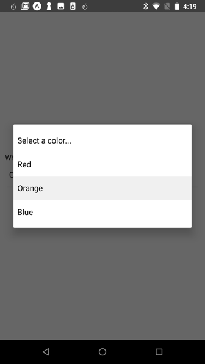

# react-native-picker-select

A Picker component for React Native which emulates the native `<select>` interfaces for iOS and Android

For iOS, we are wrapping a TextInput component. You can pass down your custom styling to match your other inputs.

For Android, we are using the native Picker component, but adding a pseudo-underline to emulate a typical TextInput. Additional styling can be passed down also to further customize the appearance.

For either platform, you can alternatively pass down a child element that will be wrapped in a touchable area, triggering the picker.

 

[Examples](https://github.com/lawnstarter/react-native-picker-select/tree/master/example)

[Run example.js](https://snack.expo.io/SJJaVK31X)

## Getting Started

### Installing

`npm install react-native-picker-select`

### Versioning

| Component | RN        |
| --------- | --------- |
| >= 3.0.0  | >= 0.55.3 |
| < 3.0.0   | < 0.55.3  |

### Props

| Name                    | Type     | Description                                                                                                                                                                                                                                                                              | Required? | iOS / Android |
| ----------------------- | -------- | ---------------------------------------------------------------------------------------------------------------------------------------------------------------------------------------------------------------------------------------------------------------------------------------- | --------- | ------------- |
| onValueChange           | function | Callback which returns `value, index`                                                                                                                                                                                                                                                    | Y         | Both          |
| items                   | array    | _ The items for the component to render. Each item should be in the following format: `{label: 'Orange',value: 'orange',key: 'orange', color: 'orange'}` _ The label and the value are required, but the key will be based upon the label if it isn't included \* The value can be any data type. The color is optional. | Y         | Both          |
| placeholder             | object   | _ An override for the default placeholder object with a label of `Select an item...` and a value of `null` _ An empty object can be used if you'd like to disable the placeholder entirely                                                                                            | N         | Both          |
| disabled                | boolean  | Disables interaction with the component                                                                                                                                                                                                                                                  | N         | Both          |
| value                   | any      | Will attempt to locate a matching value from the `items` array by checking each item's `value` property. If found, it will update the component to show that item as selected. If the value is not found, it will default to the first item.                                             | N         | Both          |
| style                   | object   | Style overrides for most parts of the component. More details below.                                                                                                                                                                                                                     | N         | Both          |
| hideDoneBar             | boolean  | Hides the bar with tabbing arrows and Done link to exit the modal. While this is typical on `select` elements on the web, the [interface guidelines](https://developer.apple.com/ios/human-interface-guidelines/controls/pickers/) does not include it.                                  | N         | iOS           |
| hideIcon                | boolean  | Hides the floating downward arrow on the right side of the input box                                                                                                                                                                                                                     | N         | iOS           |
| onUpArrow / onDownArrow | function | _ Presence enables the corresponding arrow _ Closes the picker \* Calls the callback provided                                                                                                                                                                                      | N         | iOS           |

### Styling

*   iOS
    *   The component wraps a TextInput without styling. In the style prop, pass a style object named `inputIOS` to style the input
    *   Alternatively, you can pass children (such as a custom button or input) for the component to wrap
    *   Other styles that can be modified for iOS are named `viewContainer`, `icon`, `done`, `modalViewTop`, `modalViewMiddle`, `modalViewBottom`, and `placeholderColor`
*   Android
    *   The default Picker component acts similiarly to a TextInput until it is tapped, although it does not include an underline
    *   We emulate a typical underline, which can be modified with a style object named `underline`
    *   The main input can be modified with the style object named `inputAndroid`
    *   Alternatively, you can pass children (such as a custom button or input) for the component to wrap
    *   Other styles that can be modified for Android are named `viewContainer` and `placeholderColor`

## Testing

This component has been tested on React Native v0.51 - v0.55

## Future Plans

*   [ ] Update Android picker to look closer to platform's `<select>`

## License

react-native-picker-select is [MIT licensed](https://github.com/lawnstarter/react-native-picker-select/tree/master/LICENSE)
